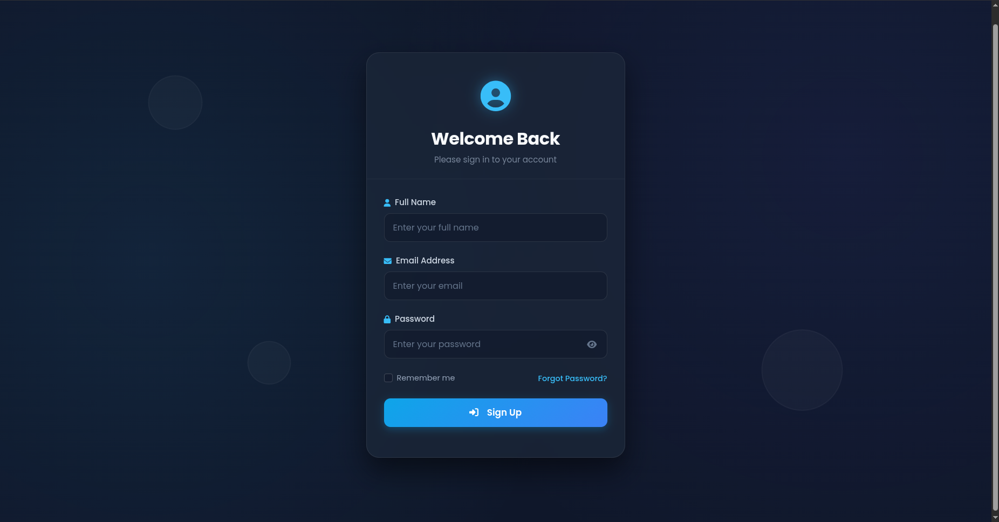
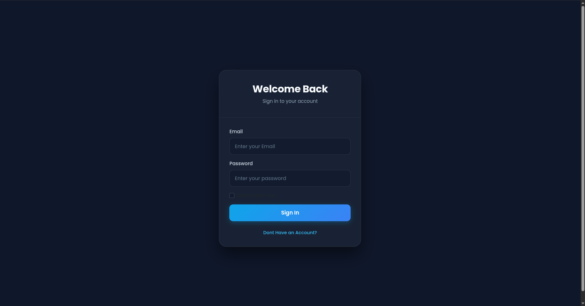
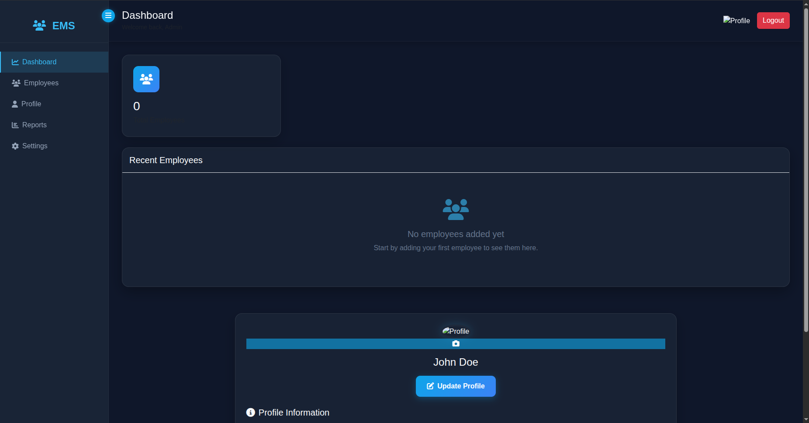

# Employee Management System - Jakarta EE

Full-stack Employee Management System built with a separate frontend and Jakarta EE backend.

## Project Overview

This project contains:

- A frontend app for Sign Up, Sign In, and Employee Dashboard UI
- A backend REST-style servlet API for user authentication and employee CRUD operations
- MySQL database integration through Apache Commons DBCP2 connection pooling

## Tech Stack

### Frontend

- HTML5
- CSS3
- JavaScript (ES6)
- jQuery 3.7.1
- Bootstrap 5
- SweetAlert2

### Backend

- Java 17
- Jakarta Servlet API 6.1
- Jackson Databind 2.19.0
- Apache Commons DBCP2 2.13.0
- MySQL Connector/J 9.0.0
- Maven

### Server & Database

- Apache Tomcat 10+
- MySQL

## Repository Structure

```text
Employee-Mng-System-JakarthaEE/
|- EMS-FND/                      # Frontend application
|  |- Pages/
|  |  |- SignUp.html
|  |  |- SignIn.html
|  |  |- DashBoard.html
|  |- Js/
|  |  |- SignUp.js
|  |  |- SignIn.js
|  |  |- DashBoard.js
|  |  |- Employee.js
|  |- css/
|     |- SignUp.css
|     |- SignIn.css
|     |- DashBoard.css
|- EMSOne/                       # Jakarta EE backend
|  |- pom.xml
|  |- src/main/java/lk/ijse/project/
|  |  |- DataSource.java
|  |  |- CorsFilter.java
|  |  |- SignUpServlet.java
|  |  |- SignInServlet.java
|  |  |- UserServlet.java
|  |  |- EmployeeServlet.java
|  |- web/
|     |- META-INF/context.xml
|     |- WEB-INF/web.xml
|- Pics/
|  |- signup.png
|  |- signin.png
|  |- dashboard.png
```

## Main Features

- User Sign Up
- User Sign In
- Session-like login state using browser localStorage
- Employee Create, Read, Update, Delete (CRUD)
- Profile section with user details loading
- Responsive dashboard UI

## Backend API Endpoints

Base URL used in frontend:

```text
http://localhost:8080/EMSOne_Web_exploded
```

### Authentication & User

- `POST /signup` - Register new user
- `GET /signup` - List users
- `POST /signIn` - Login user
- `GET /user?email={email}` - Get user profile by email
- `PUT /user` - Update user profile

### Employees

- `POST /dashboard` - Create employee
- `GET /dashboard` - Get all employees
- `PUT /dashboard` - Update employee
- `DELETE /dashboard?empid={id}` - Delete employee

## Database Setup

Database name in project configuration:

```text
eventMngSystem
```

Create database and tables:

```sql
CREATE DATABASE IF NOT EXISTS eventMngSystem;
USE eventMngSystem;

CREATE TABLE IF NOT EXISTS user (
	uid VARCHAR(50) PRIMARY KEY,
	name VARCHAR(100) NOT NULL,
	email VARCHAR(150) NOT NULL UNIQUE,
	password VARCHAR(255) NOT NULL
);

CREATE TABLE IF NOT EXISTS employee (
	empid VARCHAR(50) PRIMARY KEY,
	empName VARCHAR(100) NOT NULL,
	empMail VARCHAR(150) NOT NULL,
	empDepartment VARCHAR(100) NOT NULL,
	empPosition VARCHAR(100) NOT NULL,
	empPhone VARCHAR(30) NOT NULL,
	empSalary VARCHAR(30) NOT NULL
);
```

## Configuration

Current DB configuration appears in both:

- `EMSOne/src/main/java/lk/ijse/project/DataSource.java`
- `EMSOne/web/META-INF/context.xml`

Default values currently in project:

- Host: `localhost`
- Port: `3306`
- Database: `eventMngSystem`
- Username: `root`
- Password: `Ijse@1234`

Update these values based on your local MySQL setup.

## How To Run

### 1. Start Backend

1. Open `EMSOne` as Maven web module in your IDE.
2. Configure Apache Tomcat 10+.
3. Deploy and run the app.
4. Confirm backend is available at:

```text
http://localhost:8080/EMSOne_Web_exploded
```

### 2. Start Frontend

1. Open `EMS-FND` in VS Code.
2. Run with a static server (Five Server / Live Server).
3. Open:

```text
EMS-FND/Pages/SignUp.html
```

Then follow flow:

Sign Up -> Sign In -> Dashboard

## UI Screenshots

### Sign Up



### Sign In



### Dashboard



## Notes

- CORS is enabled globally by `CorsFilter` with `Access-Control-Allow-Origin: *`.
- Current implementation stores passwords as plain text. For production, use hashing (for example BCrypt).
- Frontend API URLs are hardcoded to localhost and exploded deployment path.

## License

This project is licensed under the terms in the `LICENSE` file.
